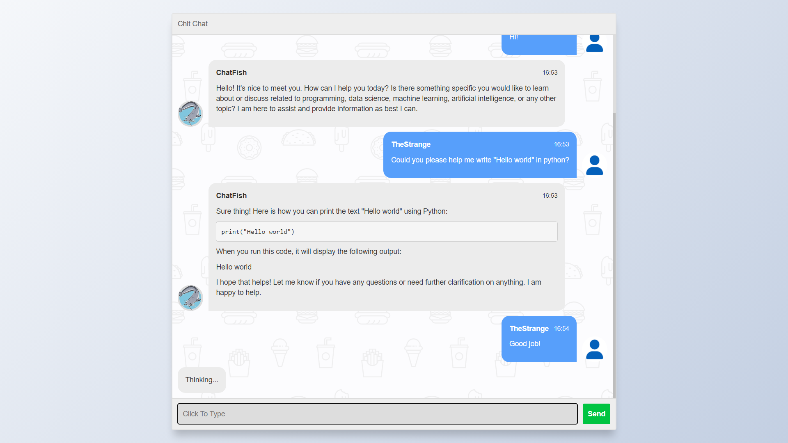

# ChatFish 📱💬

ChatFish is a simple chat application built using Flask and SocketIO. It allows users to communicate in real-time through a web interface.

## Features 🚀
- Real-time messaging using WebSocket technology.
- Simple and intuitive user interface.
- Powered by Flask, a lightweight and flexible web framework for Python.
- Uses SocketIO for WebSocket support, enabling real-time communication between clients and the server.
- Integrated with HugChat API for chatbot functionalities.

## Screenshots 📸


## Getting Started 🏁
To get started with ChatFish, follow these steps:

1. Clone this repository to your local machine:
    ```bash
    git clone https://github.com/TheStrange-007/ChatFish.git
    ```

2. Navigate to the project directory:
    ```bash
    cd ChatFish
    ```

3. Install the required dependencies:
    ```bash
    pip install -r requirements.txt
    ```

4. Run the Flask application:
    ```bash
    cd src && python app.py
    ```

5. Access the application in your web browser at [http://localhost:5000](http://localhost:5000).

## About the Project 💡
This project, ChatFish, is one of my earliest projects that I have modified using Large Language Models (LLMs) and integrated with the HugChat API for advanced chatbot functionalities.
<!-- created on: August 17, 2022 -->

## Credits 🙌
- Flask: [Flask Documentation](https://flask.palletsprojects.com/)
- SocketIO: [SocketIO Documentation](https://flask-socketio.readthedocs.io/en/latest/)
- HugChat: [HugChat API Documentation](https://pypi.org/project/hugchat/)

## License 📄
This project is licensed under the MIT License - see the [LICENSE](LICENSE) file for details.
